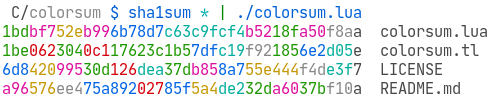

# colorsum

Inspired by this task on Rosetta Code:

https://rosettacode.org/wiki/Checksumcolor



## Usage

```sh
sha256sum files | colorsum.lua
```

## Teal

Just for fun - type safe [Teal][Teal] implementation is provided in
`./colorsum.tl`.

```
$ tl --version
0.13.1
```

[Teal]: https://github.com/teal-language/tl
